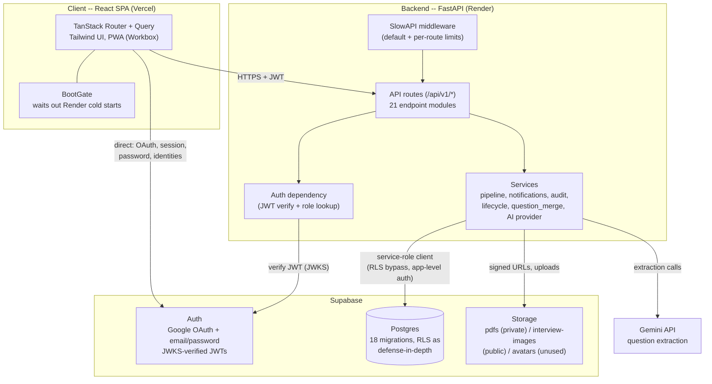
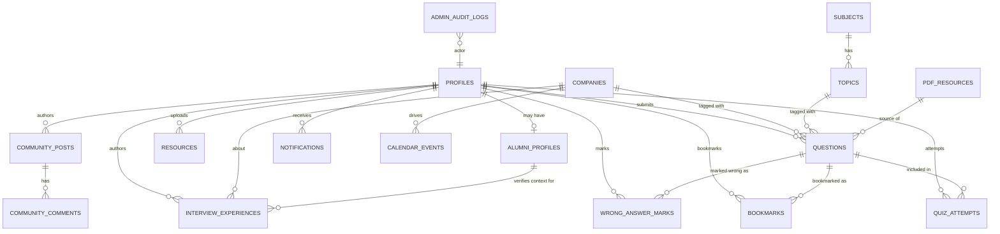
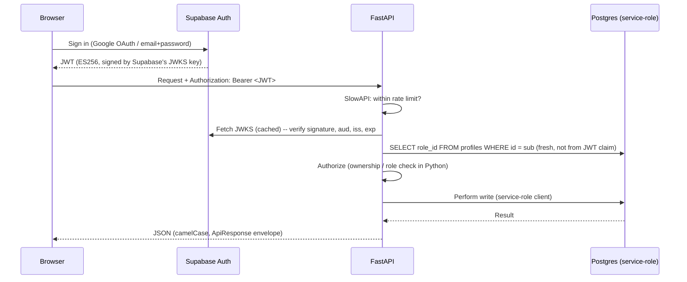

# Architecture

One diagram-first reference for how PlacePrep fits together. Everything
here describes what's actually built and deployed (see `PROJECT_STATE.md`
for the phase-by-phase history of how it got this way, and `DEPLOYMENT.md`
for how to actually stand it up).

## System overview

**Why the backend talks to Supabase with the service-role key instead of
per-user RLS-scoped requests**: every write in this API goes through
`get_supabase_admin()`, with authorization enforced in Python (role checks,
ownership checks) rather than relying on Postgres RLS to do it. RLS
policies still exist on every table (`profiles_update_own`,
`alumni_profiles_update_own_or_admin`, etc.) as defense-in-depth against a
direct table call bypassing the API entirely, but they are not the primary
authorization mechanism -- the API is. This is a deliberate, consistent
choice made from Phase 1 onward, not an oversight.

## Data model (grouped by domain)

The real schema is 18 migrations and ~25 tables -- too dense as one
diagram. Grouped by the domain each phase added:

Every entity above carries a `role_id`-gated admin lifecycle (Questions
and Resources have the full archive/soft-delete/restore/bulk pattern via
the shared `lifecycle.py` framework introduced in Phase 15; Interview
Experiences, Community, and Alumni currently have moderation actions but
not yet the same shared lifecycle framework -- see `PROJECT_STATE.md`'s
"Not yet built" notes).

## Request lifecycle: an authenticated write

The role lookup happens fresh from the database on every request rather
than trusting a role claim baked into the JWT at sign-in time -- a role
change (e.g. promoting a user to admin, or suspending one) takes effect on
their very next request instead of only after their token refreshes.

## Upload -> question pipeline

```mermaid
flowchart LR
    Upload["PDF or image upload"] --> Validate["Validate<br/>MIME type, size limit"]
    Validate --> Extract["Extract text<br/>(PDF text layer, or<br/>OCR fallback via Tesseract)"]
    Extract --> Chunk["Chunk<br/>(12k chars, 400 overlap --<br/>large-PDF support)"]
    Chunk --> AI["Gemini: extract<br/>question/options/answer"]
    AI --> Dedupe["Duplicate check<br/>(rapidfuzz similarity, 0.87 threshold)"]
    Dedupe --> Classify["Classify<br/>company / subject / topic<br/>(get-or-create)"]
    Classify --> Store["Store question<br/>+ link source PDF"]
    Store --> Notify["Notify uploader<br/>(+ admins if pending review)"]
```

Every stage fails open with a specific, surfaced error (e.g. "no
selectable text -- OCR unavailable") rather than a generic 500 -- see
`server/README.md`'s OCR section for the exact fallback behavior when the
`tesseract-ocr`/`poppler-utils` system binaries aren't installed.
